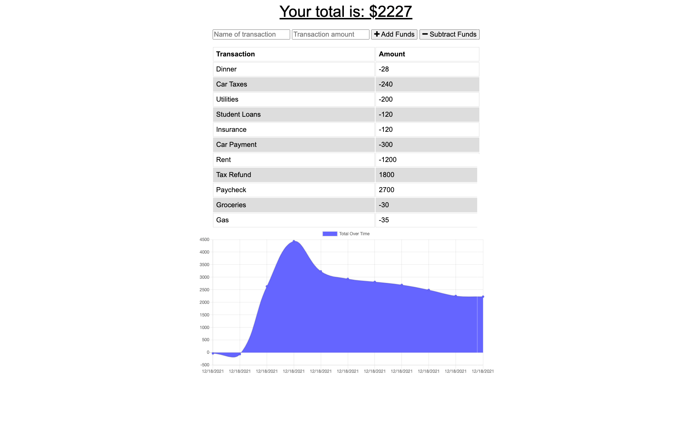

# Budget Tracker

[](https://opensource.org/licenses/MIT)

## Description

Budget Tracker was created for end users that travel or do not have constant access to internet but still need to keep up with their transactions. Budget Tracker allows the user to add deposits/expenses within the tracker while offline and then updates the DB once the user is online again. This progressive web application utilizes NoSQL and Express.js.

## Table of Contents

- [Description](#description)
- [Installation](#installation)
- [Usage](#usage)
- [License](#license)
- [Screenshot](#screenshot)
- [Deployed Application](#deployed-application)
- [Questions](#questions)

## Installation

To install necessary dependencies, please run the following command:

```
npm install
```

## Usage

To use the application, simply add expenses and deposits from the webpage and watch the tracker grow!

## License

This project is covered under the MIT license. Visit the following link for more information on this license: [MIT](https://opensource.org/licenses/MIT)

## Screenshot



## Deployed-Application

[Link to deployed application](https://budget-tracker-dubose.herokuapp.com/)

## Questions

For any questions about the project, please contact me by either of the following links:

- Email - jordan.dubose1@gmail.com

or visit my GitHub profile:

- GitHub - [jordandub1](https://github.com/jordandub1)
